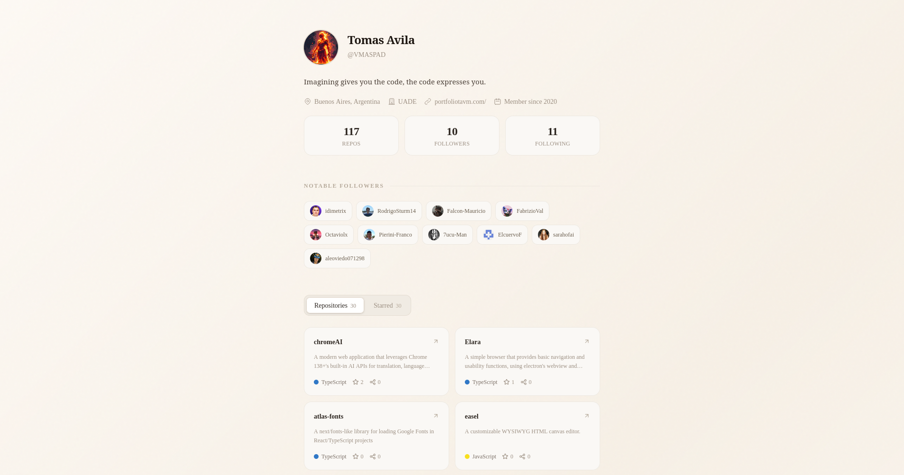

# Gitfolio

> **Instant developer portfolios — powered by GitHub.**
> Visit `/portfolio?user=vmaspad&type=bento` and get a beautiful, shareable portfolio in seconds — zero config, zero sign-up.



---

## What is this?

Gitfolio turns any public GitHub profile into a polished, fully-themed portfolio page. You just pass a GitHub username and a layout type as URL parameters, and the app fetches the profile data directly from the GitHub API and renders it live.

No database. No accounts. No configuration files. If it's public on GitHub, it shows up here.

---

## Live demo

```
https://better-portfolio-nine.vercel.app/portfolio?user=torvalds&type=bento
https://better-portfolio-nine.vercel.app/portfolio?user=gaearon&type=minimal
https://better-portfolio-nine.vercel.app/portfolio?user=sindresorhus&type=vercel
https://better-portfolio-nine.vercel.app/portfolio?user=tj&type=enterprise
```

---

## URL parameters

| Parameter | Required | Values                                    | Default      |
|-----------|----------|-------------------------------------------|--------------|
| `user`    | ✅        | any valid GitHub username                 | —            |
| `type`    | ❌        | `bento` · `minimal` · `vercel` · `enterprise` | `bento`  |
| `theme`   | ❌        | `dark` · `light`                          | `dark`       |

### Examples

```bash
# Bento grid layout, dark mode (default)
/portfolio?user=vmaspad

# Vercel-style minimal, light mode
/portfolio?user=vmaspad&type=vercel&theme=light

# Enterprise terminal layout
/portfolio?user=vmaspad&type=enterprise
```

---

## Layouts

### `bento` — Bento Grid
Asymmetric grid of cards. Stats, skills, repos, followers and contact form arranged in a magazine-style layout. Uses `Chakra Petch` + `IBM Plex Mono`. Burnt orange accent in dark mode.

### `minimal` — Claude / MagicUI Style
Single-column, generous whitespace. Warm beige palette, Georgia serif headings. Inspired by [portfolio-magicui.vercel.app](https://portfolio-magicui.vercel.app).

### `vercel` — Vercel Style
Pure black background, Geist Mono throughout, hairline borders, no border-radius. Data tables for repos and followers. Dark/light toggle in topbar.

### `enterprise` — Enterprise Terminal
Bloomberg Terminal meets Linear. Zero border-radius, amber accent, live PDT clock, scanlines on hero. Repos rendered as sortable data tables.

---

## Data sourced from GitHub

Gitfolio uses only the **public GitHub REST API** — no OAuth, no tokens required for basic usage.

| GitHub API endpoint | Used for |
|---|---|
| `GET /users/:username` | Name, bio, location, company, followers, repos count |
| `GET /users/:username/repos` | Public repositories list |
| `GET /users/:username/followers` | Follower profiles |
| `GET /users/:username/starred` | Starred repositories |
| `GET /users/:username/subscriptions` | Watched repositories |

> **Rate limits:** The unauthenticated GitHub API allows 60 requests/hour per IP. For production, add a `GITHUB_TOKEN` to your `.env` to raise this to 5,000 requests/hour.

---

## Tech stack

- **Framework** — [Next.js 15](https://nextjs.org) (App Router)
- **Styling** — [Tailwind CSS v4](https://tailwindcss.com) with CSS custom properties (oklch color tokens)
- **Fonts** — `Chakra Petch`, `IBM Plex Mono`, `Geist Mono` via `next/font/google`
- **Data** — GitHub REST API v3 (no SDK, plain `fetch`)
- **Deployment** — [Vercel](https://vercel.com) (recommended)

---

## Project structure

```
.
├── app/
│   ├── layout.tsx              # Root layout — SEO metadata, fonts, JSON-LD
│   ├── page.tsx                # Landing page / username input
│   ├── portfolio/
│   │   └── page.tsx            # Portfolio renderer — reads ?user= and ?type=
│   └── globals.css             # Tailwind + CSS token definitions
│
├── components/
│   ├── layouts/
│   │   ├── BentoPortfolio.tsx
│   │   ├── MinimalPortfolio.tsx
│   │   ├── VercelPortfolio.tsx
│   │   └── EnterprisePortfolio.tsx
│   └── ui/                     # Shared atoms (Chip, Tag, StatusDot, etc.)
│
├── lib/
│   └── github.ts               # GitHub API fetch helpers + types
│
└── public/
    ├── og-default.png
    ├── favicon.ico
    └── site.webmanifest
```

---

## Getting started

### 1. Clone

```bash
git clone https://github.com/vmaspad/gitfolio.git
cd gitfolio
```

### 2. Install

```bash
pnpm install
# or npm install / yarn install
```

### 3. Run

```bash
pnpm dev
```

Open [http://localhost:3000/portfolio?user=YOUR_USERNAME&type=bento](http://localhost:3000/portfolio?user=torvalds&type=bento).

---

## GitHub API helper

`lib/github.ts` exports typed fetch functions used by the portfolio page:

```typescript
import { getGithubUser, getGithubRepos, getGithubFollowers } from "@/lib/github";

// In your page or server component:
const user      = await getGithubUser("vmaspad");
const repos     = await getGithubRepos("vmaspad");
const followers = await getGithubFollowers("vmaspad");
```

Responses are cached via Next.js `fetch` with `revalidate: 3600` (1 hour).

---

## Per-page SEO (portfolio route)

The `/portfolio/page.tsx` generates dynamic metadata for each user, so every shareable link gets its own OG image title and description:

```typescript
// app/portfolio/page.tsx
export async function generateMetadata({ searchParams }): Promise<Metadata> {
  const username = searchParams.user ?? "unknown";
  const user     = await getGithubUser(username);

  return {
    title:       `${user.name ?? username} — Portfolio`,
    description: user.bio ?? `${username}'s developer portfolio generated from GitHub.`,
    openGraph: {
      title:  `${user.name ?? username} on Gitfolio`,
      images: [user.avatar_url],
    },
    twitter: {
      card:   "summary",
      images: [user.avatar_url],
    },
  };
}
```

---

## Deployment

### Vercel (recommended)

```bash
pnpm dlx vercel
```

Set the environment variables in the Vercel dashboard under **Settings → Environment Variables**.

### Docker

```dockerfile
FROM node:20-alpine AS builder
WORKDIR /app
COPY . .
RUN npm ci && npm run build

FROM node:20-alpine AS runner
WORKDIR /app
COPY --from=builder /app/.next/standalone ./
COPY --from=builder /app/public ./public
EXPOSE 3000
CMD ["node", "server.js"]
```

---

## Contributing

PRs are welcome. To add a new layout:

1. Create `components/layouts/YourLayout.tsx` — must accept a `user` prop matching the GitHub API schema.
2. Register the new `type` string in `app/portfolio/page.tsx`.
3. Add an entry to the `LAYOUTS` constant and the README table above.
4. Open a PR with a screenshot or screen recording.

---

## License

MIT